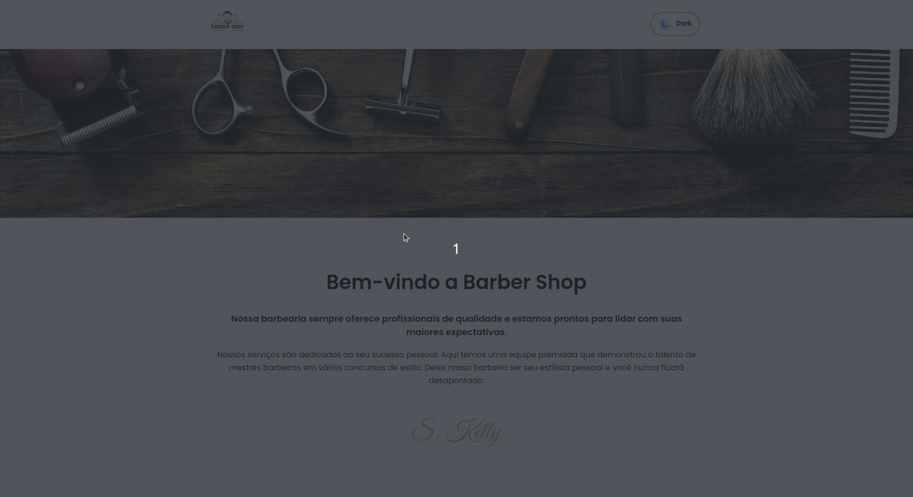

  <a href="#-tecnologias">Tecnologias</a>&nbsp;&nbsp;&nbsp;|&nbsp;&nbsp;&nbsp;
  <a href="#-projeto">Projeto</a>&nbsp;&nbsp;&nbsp;|&nbsp;&nbsp;&nbsp;
  <a href="#memo-licença">Licença</a>

 

  

 

  

## 🚀 Tecnologias

Esse projeto foi desenvolvido com as seguintes tecnologias:

- Javascript
- React.JS
- HTML
- CSS

## 💻 Projeto

Mini Mundo - Landing page para barbearia

O objetivo do projeto é criar uma Landing Page com a funcionalidade de alterar o tema de fundo, com base na ação feita pelo usuário (evento de clique).
A landing page será autocontida, ou seja, não haverá navegação para outras páginas (internas ou externas).

A página deve ser compatível com diversos tipos de resolução de telas, por exemplo:
a.  Desktop (1920px)
b.  Laptop (1440px)
c.  Tablet (768px)
d.  Mobile (375px)

A página terá um efeito interativo conhecido como "Dark mode". Basicamente a ideia é mudar o layout para a página se tornar mais agradável de ler a noite. Isso vai acontecer através do clique no botão 'Dark', posicionado no topo da página. Clicando novamente no botão, a página retorna para seu estado original (modo light).

## 🖥️ Como visualizar meu projeto?

Você pode acessar o link abaixo e visualizar o deploy:

ou

Baixe este repositório e com seu terminal, entre no diretório

1. Execute o comando `npm install` para instalar as dependências
2. Após, execute o comando `npm run init-db` para instalar o banco de dados
3. E para iniciar o aplicativo, execute o comando `npm start` 

## :memo: Licença

Esse projeto está sob a licença MIT. Veja o arquivo [LICENSE](.github/LICENSE.md) para mais detalhes.

---

  Feito com ♥ by Andresa A Ribeiro :wave:

